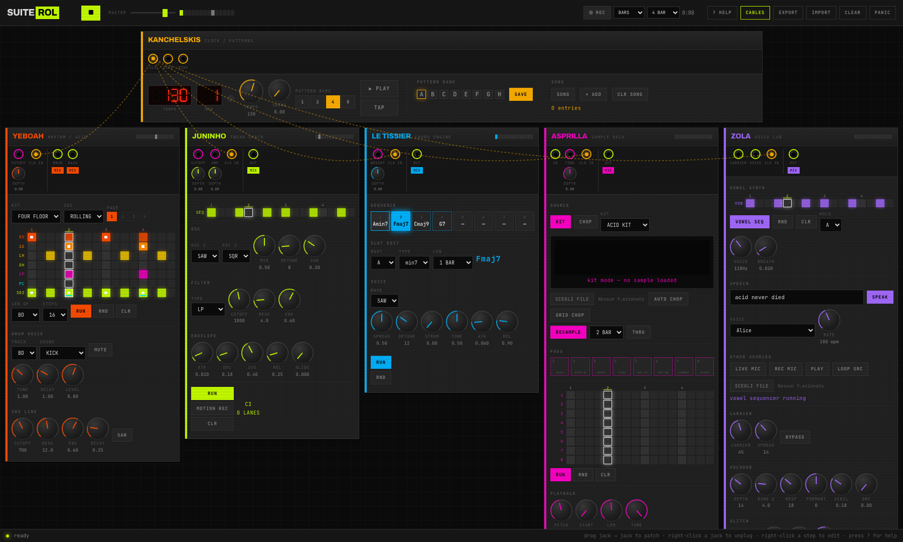

# SUITE ROL

**Sei strumenti musicali collegabili con i cavi, dentro il browser.**
Batteria, basso acid, sintetizzatore, accordi, campionatore e un laboratorio
vocale. Non serve nessun programma di musica: si apre e si suona.

*Six patchable music instruments that run in your browser. Drums, acid bass,
synth, chords, sampler and a voice lab. No music software needed.*



🇮🇹 [Istruzioni in italiano](#-italiano) · 🇬🇧 [Instructions in English](#-english)

---

# 🇮🇹 ITALIANO

## Come si avvia (la via facile)

Non serve sapere niente di programmazione. Sono 4 passaggi.

### 1. Scarica

In cima a questa pagina c'è un pulsante verde **`Code`**.
Cliccalo, poi clicca **`Download ZIP`**.

Il file finisce nella cartella **Download** del tuo Mac.

### 2. Estrai

Vai nella cartella Download e fai **doppio click** sul file `.zip` appena
scaricato.

Si crea una cartella con lo stesso nome. Aprila.

### 3. Avvia

Dentro la cartella trovi un file che si chiama:

```
AVVIA-SUITE-ROL.command
```

**Fai click con il tasto destro** su quel file, poi scegli **`Apri`**.

> ⚠️ **Importante: la prima volta usa il tasto destro, non il doppio click.**
>
> Il Mac non conosce chi ha scritto questo file, quindi al doppio click si
> rifiuta di aprirlo. Se invece usi tasto destro → `Apri`, compare una
> finestrella: clicca ancora **`Apri`** e il Mac se lo ricorda per sempre.
> Dalla seconda volta in poi basta il doppio click normale.

Si apre una finestra nera con delle scritte. **È normale, non spaventarti.**
La prima volta ci mette circa un minuto (sta scaricando quello che serve, e
serve internet). Poi il browser si apre da solo.

### 4. Suona

Nella pagina che si è aperta clicca il pulsante grande **`POWER ON`**.

Parte la musica. Da qui in poi vedi il paragrafo
[Cosa faccio adesso](#cosa-faccio-adesso).

**Per fermare tutto:** chiudi la finestra nera.

---

## Se qualcosa non va

### «Mi dice che manca Node.js»

Node.js è il motore che fa girare la suite. È gratis e ufficiale.
Il file di avvio ti apre da solo la pagina giusta: scarica il **pulsante grande
a sinistra (LTS)**, installalo come un normale programma, poi torna sulla
cartella e riapri `AVVIA-SUITE-ROL.command`.

### «Il Mac dice che non può aprire il file perché è di uno sviluppatore non identificato»

È il caso descritto sopra: **tasto destro sul file → `Apri` → `Apri`**.
Non usare il doppio click la prima volta.

### «Ho fatto tasto destro ma non c'è scritto Apri»

Apri l'app **Terminale** (la trovi con la lente di ingrandimento in alto a
destra, scrivi "Terminale"). Poi scrivi questo, **con uno spazio alla fine**:

```
chmod +x 
```

e **trascina dentro la finestra del Terminale** il file
`AVVIA-SUITE-ROL.command`. Premi Invio. Ora il doppio click funziona.

### «La finestra nera si apre e si chiude subito»

Vuol dire che c'è stato un errore. Riaprila con tasto destro → `Apri` e leggi
il messaggio in rosso: di solito dice che manca Node.js o che non c'è internet.

### «Non si sente niente»

- Hai cliccato **`POWER ON`** nella pagina?
- Controlla il volume del Mac e il cursore **MASTER** in alto nella pagina.
- Il pulsante **▶** in alto a sinistra deve essere acceso (verde).

---

## Cosa faccio adesso

La suite parte già suonando qualcosa. Prova queste cose in ordine.

### Le basi

| Cosa | Come |
|---|---|
| Play / stop | Barra spaziatrice, o il pulsante **▶** in alto |
| Cambiare velocità | La manopola **TEMPO** su KANCHELSKIS (trascina su e giù) |
| Accendere/spegnere un passo | Clicca sui quadratini della griglia |
| Cambiare la nota di un passo | **Tasto destro** sul quadratino |
| Manuale completo dentro l'app | Premi **`?`** oppure il pulsante **HELP** |

### I sei strumenti

| Nome | Cosa fa |
|---|---|
| **KANCHELSKIS** | Il metronomo che comanda tutti. Qui salvi anche i pattern |
| **YEBOAH** | Batteria + basso acid (quello che fa *"wooow"*) |
| **JUNINHO** | Sintetizzatore per melodie |
| **LE TISSIER** | Accordi |
| **ASPRILLA** | Campionatore: suoni pronti, o registra e taglia |
| **ZOLA** | Voce robotica: scrivi una frase e la fa cantare |

I nomi sono calciatori della Premier League anni '90.

### Prova subito queste tre cose

**1. Cambia il ritmo**
Su YEBOAH, in alto, c'è un menu che dice `FOUR FLOOR`. Aprilo e scegli
`BERLIN` o `BREAK`. Cambia tutto il pezzo.

**2. Fai parlare il robot**
Su ZOLA scrivi una frase nel campo di testo e premi **`SPEAK`**.
Con il menu **VOICE** scegli una voce italiana (Alice). Con la manopola
**RATE** rallenta molto: viene fuori una voce lentissima e robotica.

**3. Registra quello che hai fatto**
In alto c'è **`REC`**. Lascia impostato `BARS` e `4 BAR`, premi REC:
registra 4 battute e ti scarica un file audio WAV, che puoi mandare a chi vuoi.

---

## I cavi (la parte divertente)

Ogni strumento ha dei cerchietti colorati in alto: sono le **prese**, come in
un sintetizzatore vero.

- **Per collegare:** trascina da una presa a un'altra.
- **Per staccare:** tasto destro sulla presa.
- **Per vedere dove va un cavo:** passaci sopra il mouse, si illumina.
- **Se ti danno fastidio:** il pulsante **CABLES** in alto li nasconde.

### Cosa significano i colori

| Colore | Cosa porta |
|---|---|
| 🟢 Verde | **Audio**: il suono vero e proprio |
| 🟣 Magenta | **CV**: non si sente, muove una manopola da solo |
| 🟠 Ambra | **Clock**: il tempo. Senza questo cavo uno strumento resta fermo |

### «Se collego la batteria a un altro strumento cosa succede?»

Dipende da **dove la colleghi**. Il cavo non "mette uno strumento dentro
l'altro": porta il suo segnale a un ingresso preciso, e decide l'ingresso.

| Colleghi DRUM a… | Risultato |
|---|---|
| **IN** di ASPRILLA | La batteria entra nel campionatore, e `RESAMPLE` la registra |
| **CUTOFF** (magenta) | La batteria non si sente lì: apre e chiude il filtro a tempo, fa il "pompaggio" |
| **CARRIER** di ZOLA | La voce prende il timbro della batteria |

⚠️ Sui cavi magenta ricordati la manopolina **DEPTH** sotto la presa:
**parte da zero**, quindi finché non la alzi il cavo non fa niente. È fatto
apposta, così collegare un cavo non rovina mai il suono per sbaglio.

E non preoccuparti: uno strumento **continua a suonare normalmente** anche se
lo colleghi da qualche parte, perché il pulsante **MIX** è acceso.

---

## Salvare il tuo lavoro

- **Si salva da solo.** Chiudi e riapri: ritrovi tutto com'era.
- **Slot A–H** su KANCHELSKIS: clicca una lettera per selezionarla, poi
  **`SAVE`**. Salva *tutti e cinque* gli strumenti insieme. Clicca su una
  lettera già piena per richiamarla.
- **`EXPORT`** in alto salva un file col tuo lavoro, **`IMPORT`** lo ricarica.
- **`CLEAR`** cancella tutto (chiede conferma una volta).

---

# 🇬🇧 ENGLISH

## How to start (the easy way)

No programming knowledge needed. Four steps.

### 1. Download

At the top of this page there is a green **`Code`** button.
Click it, then click **`Download ZIP`**.

The file lands in your **Downloads** folder.

### 2. Unzip

Go to Downloads and **double-click** the `.zip` file you just downloaded.
A folder with the same name appears. Open it.

### 3. Launch

Inside the folder there is a file called:

```
AVVIA-SUITE-ROL.command
```

**Right-click** it, then choose **`Open`**.

> ⚠️ **Important: the first time, right-click — do not double-click.**
>
> Your Mac does not know who wrote this file, so a plain double-click will be
> refused. Right-click → `Open` shows a small dialog: click **`Open`** again
> and macOS remembers it forever. From the second time on, a normal
> double-click works.

A black window with text opens. **This is normal.** The first run takes about
a minute (it is downloading what it needs, so you need an internet connection).
Then your browser opens by itself.

### 4. Play

In the page that opened, click the big **`POWER ON`** button.

The music starts. Carry on at [What do I do now](#what-do-i-do-now).

**To stop everything:** close the black window.

---

## If something goes wrong

### "It says Node.js is missing"

Node.js is the engine that runs the suite. It is free and official.
The launcher opens the right page for you: download the **big left-hand button
(LTS)**, install it like any normal app, then go back to the folder and open
`AVVIA-SUITE-ROL.command` again.

### "macOS says it cannot open the file, unidentified developer"

That is the case described above: **right-click the file → `Open` → `Open`**.
Do not double-click it the first time.

### "I right-clicked but there is no Open"

Open the **Terminal** app (search for "Terminal" with the magnifying glass at
the top right). Type this, **with a space at the end**:

```
chmod +x 
```

then **drag the `AVVIA-SUITE-ROL.command` file into the Terminal window** and
press Enter. Double-click now works.

### "The black window opens and closes immediately"

Something failed. Reopen it with right-click → `Open` and read the message in
red: usually it says Node.js is missing, or there is no internet.

### "I hear nothing"

- Did you click **`POWER ON`** in the page?
- Check your Mac volume and the **MASTER** slider at the top of the page.
- The **▶** button at the top left must be lit (green).

---

## What do I do now

The suite boots already playing something. Try these in order.

### Basics

| What | How |
|---|---|
| Play / stop | Spacebar, or the **▶** button at the top |
| Change speed | The **TEMPO** knob on KANCHELSKIS (drag up and down) |
| Turn a step on/off | Click the little squares in the grid |
| Change a step's note | **Right-click** the square |
| Full manual inside the app | Press **`?`** or the **HELP** button |

### The six instruments

| Name | What it does |
|---|---|
| **KANCHELSKIS** | The metronome that drives everything. Also where you save patterns |
| **YEBOAH** | Drums + acid bass (the *"wooow"* sound) |
| **JUNINHO** | Synth for melodies |
| **LE TISSIER** | Chords |
| **ASPRILLA** | Sampler: ready-made sounds, or record and slice your own |
| **ZOLA** | Robot voice: type a sentence and it sings it |

The names are nineties Premier League players.

### Three things to try right now

**1. Change the groove**
On YEBOAH, at the top, there is a menu reading `FOUR FLOOR`. Open it and pick
`BERLIN` or `BREAK`. The whole track changes.

**2. Make the robot talk**
On ZOLA, type a sentence in the text field and press **`SPEAK`**.
Use the **VOICE** menu to pick a voice, and turn the **RATE** knob right down
for a very slow, robotic delivery.

**3. Record what you made**
**`REC`** is at the top. Leave it on `BARS` and `4 BAR`, press REC: it records
4 bars and downloads a WAV audio file you can send to anyone.

---

## The cables (the fun part)

Every instrument has coloured circles along its top: those are **sockets**,
like on a real modular synth.

- **To connect:** drag from one socket to another.
- **To disconnect:** right-click the socket.
- **To see where a cable goes:** hover over the socket, it lights up.
- **If they are in the way:** the **CABLES** button at the top hides them.

### What the colours mean

| Colour | What it carries |
|---|---|
| 🟢 Green | **Audio**: the actual sound |
| 🟣 Magenta | **CV**: silent, it moves a knob on its own |
| 🟠 Amber | **Clock**: the timing. Without this cable an instrument stays still |

### "What happens if I connect the drums to another instrument?"

It depends on **where** you connect them. A cable does not "put one instrument
inside another": it carries its signal to a specific input, and the input
decides what happens.

| Connect DRUM to… | Result |
|---|---|
| ASPRILLA's **IN** | The drums enter the sampler, and `RESAMPLE` records them |
| **CUTOFF** (magenta) | The drums are not heard there: they open and close the filter in time — the classic pumping |
| ZOLA's **CARRIER** | The voice takes on the timbre of the drums |

⚠️ On magenta cables, remember the small **DEPTH** knob under the socket:
it **starts at zero**, so until you turn it up the cable does nothing. That is
deliberate — plugging a cable in can never ruin the sound by accident.

And don't worry: an instrument **keeps playing normally** even when you patch
it somewhere, because the **MIX** button is on.

---

## Saving your work

- **It saves itself.** Close and reopen: everything is where you left it.
- **Slots A–H** on KANCHELSKIS: click a letter to select it, then **`SAVE`**.
  It stores *all five* instruments together. Click an already-filled letter to
  recall it.
- **`EXPORT`** at the top saves your work to a file, **`IMPORT`** loads it back.
- **`CLEAR`** wipes everything (it asks once to confirm).

---

# For developers

Vanilla ES modules, native Web Audio, no build step. Express only serves the
files and proxies text-to-speech.

```bash
npm install
npm run dev          # http://localhost:3333
npm test             # logic smoke test (jsdom + stubbed Web Audio)
npm run test:audio   # renders each module offline and measures its level
npm run test:ui      # drives the real page in Chrome: hit-testing, bank, clear
npm run test:all     # all three (the last two need the dev server running)
```

Append `#autostart` to the URL to skip the splash screen.

`test:audio` answers "does this module actually make sound" — it renders each
module through an `OfflineAudioContext` and reports RMS, so a silent module
fails the build instead of being discovered by ear. `test:ui` hit-tests every
visible control with `elementFromPoint`; that is how the bug where cables were
swallowing clicks meant for the knobs was found — the controls rendered
perfectly and were simply unreachable.

## Architecture

```
js/
├── core/
│   ├── audio-engine.js   single AudioContext, master bus + limiter, channels
│   ├── clock.js          lookahead scheduler (setTimeout drives currentTime)
│   ├── patch-graph.js    edges own REAL Web Audio connections
│   ├── patterns.js       pattern bank + song mode
│   ├── recorder.js       master capture to WAV
│   └── module-base.js    jack registry, channel, state serialisation
├── dsp/
│   ├── drums.js          14 synthesised voices, no samples
│   ├── acid.js           303 voice: env-modulated resonant LP, accent, slide
│   ├── formant.js        vowel synthesiser (ZOLA's built-in voice source)
│   ├── vocoder.js        16-band analysis/resynthesis, native nodes only
│   └── presets.js        factory patterns and kits
├── ui/                   knob, step-grid, led-display, vu, panel, patch-bay, help
├── modules/              one file per module
└── main.js               boot, persistence, transport, import/export
```

Three invariants worth knowing before editing:

- **Every edge is real.** `PatchGraph.connect()` creates the Web Audio
  connection and stores its teardown. There is no path where the drawing and
  the sound disagree.
- **The clock never touches `currentTime` directly.** Listeners get a timestamp
  slightly in the future and must schedule against it. Anything that plays
  "now" will drift.
- **Step grids read patterns through a getter, never a captured reference.**
  Modules replace their pattern arrays wholesale (clear, preset load, bank
  recall); a held reference silently renders a stale array forever.

## Text-to-speech

The server tries providers in order and returns a WAV either way, so speech
lands in a buffer and goes **through the vocoder** like any other source.

**1. macOS `say` — nothing to install.** Works out of the box. Unlike browser
speech synthesis, it writes a real WAV, so it can be routed through the chain.

**2. Piper — optional, better voices.** There is no `piper-tts` Homebrew
formula. Install via `python3 -m pip install piper-tts`, or grab a prebuilt
binary from [the releases page](https://github.com/rhasspy/piper/releases)
(`piper_macos_aarch64.tar.gz` on Apple Silicon). Then fetch a voice model plus
its `.json` from [rhasspy/piper-voices](https://huggingface.co/rhasspy/piper-voices)
and start the server pointing at it:

```bash
PIPER_BIN=/path/to/piper \
PIPER_MODEL=/path/to/it_IT-riccardo-x_low.onnx \
npm run dev
```

Check which provider is live with `curl -s localhost:3333/api/health`.

**3. Browser speech — last resort.** If neither provider exists, ZOLA falls
back to `speechSynthesis`. That audio cannot be captured into a buffer, so it
bypasses the vocoder entirely — the module says so rather than pretending.

## Known limits

- Pitch shifting is playback-rate based, so it changes length. A proper
  formant-preserving shifter needs an AudioWorklet.
- The master recorder uses `ScriptProcessor`, deprecated but the only way to
  get raw float samples without a worklet. Works everywhere today.
- The looper records through `MediaRecorder`, which adds encode latency —
  layers can land a few milliseconds late.
- Web MIDI is not wired up; the `midi` jack type exists but nothing emits it.
- Windows and Linux have no launcher: use `npm install && npm run dev`.

## License

MIT
